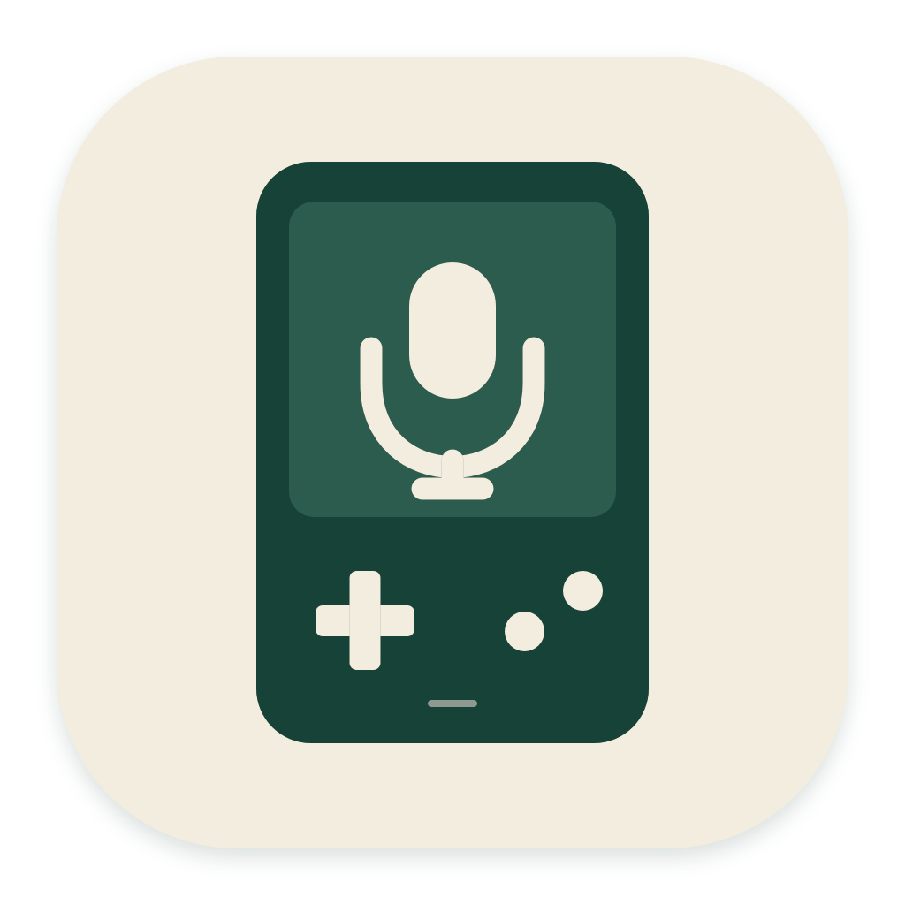

# Brick Mic

把 **TrimUI Brick** 变成 Mac 的语音输入按钮：按住 **A** 说话，松开后把识别文字填入当前应用。

**掌机仅适配 NextUI；Mac 需要 macOS 13 或更新版本，当前预编译包适用于 Apple Silicon（M 系列）。** 语音通过蓝牙传输，百炼负责识别；Mac 需要联网，掌机不需要 Wi-Fi。

## 下载与安装

从 [最新 Release](https://github.com/Drafffffff/brick-mic/releases/latest) 下载两个安装包：

| 安装包 | 安装位置 |
| --- | --- |
| [BrickMic-macOS-arm64.zip](https://github.com/Drafffffff/brick-mic/releases/latest/download/BrickMic-macOS-arm64.zip) | 解压，将 `Brick Mic.app` 拖到 Mac「应用程序」 |
| [BrickMic-TrimUI-Brick-NextUI.zip](https://github.com/Drafffffff/brick-mic/releases/latest/download/BrickMic-TrimUI-Brick-NextUI.zip) | 解压，将 `Brick Mic.pak` 文件夹拷到 SD 卡 `Tools/tg5040/` |

1. 打开 Mac 的 **Brick Mic**，允许蓝牙。在右上角 **设置** 中填入 [百炼 API Key](https://bailian.console.aliyun.com/)，点 **保存**。已有 `~/.zshrc` 的 `DASHSCOPE_API_KEY` 会自动读取。
2. 掌机打开 **工具 → Brick Mic**，等待连接。
3. Mac 开启 **自动输入**，点 **允许自动输入…**，在 **系统设置 → 隐私与安全性 → 辅助功能** 中允许 `/Applications/Brick Mic.app`。
4. 点一下目标应用的文本框，按住掌机 **A** 说话，松开结束。**B** 取消，**MENU** 返回 NextUI；也可以在 Mac 复制识别文字。

Mac 包采用本地签名，尚未经过 Apple 公证。如果系统阻止打开，请按 [Apple 的说明](https://support.apple.com/zh-cn/102445)在「隐私与安全性」中选择「仍要打开」。请始终从「应用程序」启动，避免给开发目录中的副本配置权限。

## 日常使用

- 点击菜单栏图标打开或收起窗口；右键图标或点窗口的 **…** 可重新连接、退出。关闭窗口会继续接收语音。
- 设置中的 **测试输入** 会等待 3 秒，方便先点击目标文本框。识别期间切换前台应用时，结果保留供复制；不会自动敲回车或发送消息。
- 掌机短按电源息屏，再短按快速唤醒，蓝牙连接持续保留。此模式比深度休眠耗电；长按电源关机才停止。停在 Brick Mic 关机后，开机会恢复该应用；按 MENU 退出则恢复 NextUI。
- 不保存正常录音或识别历史；Mac 录音时将音频上传百炼，结束后一次显示完整结果。这是语音转文字工具，不会注册 macOS 系统麦克风设备。
- 默认模型为 `qwen3-asr-flash-realtime`，使用北京服务。Key、模型与服务地域需要匹配；模型与地址可在 **设置 → 高级设置** 修改。

Key 保存到 `~/.zshrc` 的 `DASHSCOPE_API_KEY`，保留其他配置，不访问钥匙串。也支持从 `.bashrc`、Fish 配置或进程环境读取，兼容 `BAILIAN_API_KEY`。

[完整编译教程](docs/BUILD.md) · [工作原理与限制](docs/ARCHITECTURE.md) · [第三方说明](THIRD_PARTY_NOTICES.md)

## 开源协议

代码采用 [GPL-3.0](LICENSE)。PocketJS、QuickJS、Solid、Go 依赖和字体按各自许可证分发。感谢 [NextUI](https://github.com/LoveRetro/NextUI)、[PocketJS](https://github.com/pocket-nexus/pocketjs) 与各字体作者。
